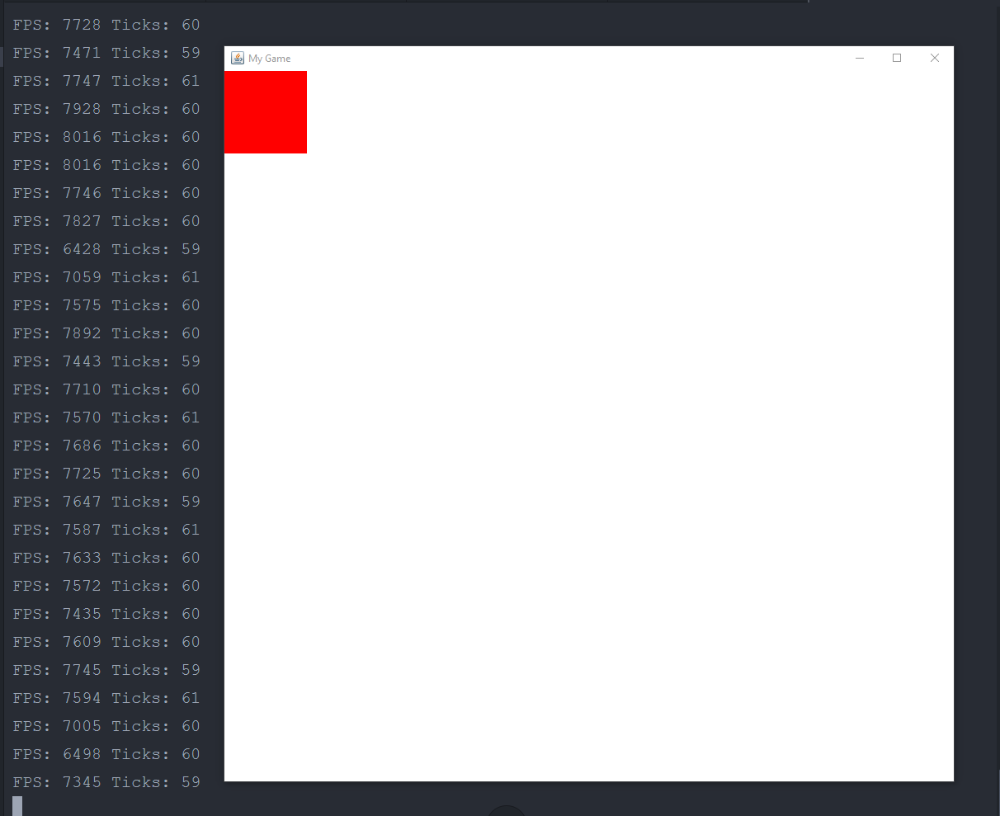

# Freddie API
I found myself replicating the same methods and classes when creating Graphical Programs and I created a library which helps you structure your Game/Graphics Enviroment with ease while being able to access lower levels of functionality in Java.Examples of usage will be uploaded when their functionality develops.


# Examples

```Java
//Your basic component must extend FCanvas
class Game extends FCanvas {
  //Your class variables
  private int rectW;
  private int rectH;

  //Main has to make an instance of an FCanvas object and store it in a Peer
  public static void main(String[] args) {
    Game game = new Game();
    game.setFPSLOG(true); //Will log FPS and Updates in console
    FWindow win = new FWindow(900, 900, "My Game", game);
    game.start();
  }
  //Called every 60 times a second
  @Override
  public void update() {
  }
  //Called once after start
  @Override
  public void init() {
    setBackground(Color.white) //Black is default
    rectW = 100;
    rectH = 100;
  }
  @Override
  public void draw(Graphics g) {
    g.setColor(Color.red);
    g.fillRect(0, 0, rectW, rectH);
  }
  
}

```

This results in the following window :

<<<<<<< HEAD
=======


# License
  MIT 2019
  

>>>>>>> 063f3121652bb33809166d7eda53b0018eb734b4
